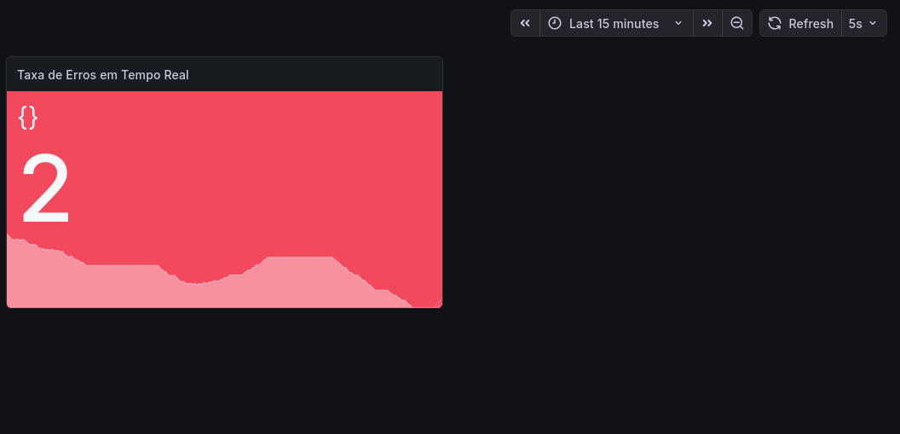

# 📊 Observability Pipeline: Python + Grafana Loki

Projeto focado em **SRE (Site Reliability Engineering)** para monitoramento proativo de erros em sistemas distribuídos.

## 🎯 Objetivo
Transformar logs brutos em métricas visuais acionáveis para reduzir o tempo de detecção de falhas (MTTD).

## 🛠️ Tecnologias
* **Linguagem:** Python
* **Logs:** `python-logging-loki`
* **Armazenamento:** Grafana Loki
* **Visualização:** Grafana Dashboards

## 📸 Demonstração

*O painel utiliza thresholds dinâmicos: Verde para saúde estável e Vermelho para picos de erro 500.*

## ⚙️ Como rodar este projeto
1. Instale as dependências: `pip install python-logging-loki`
2. Configure suas credenciais do Grafana Cloud no arquivo `src/main.py`
3. Execute o script: `python src/main.py`
